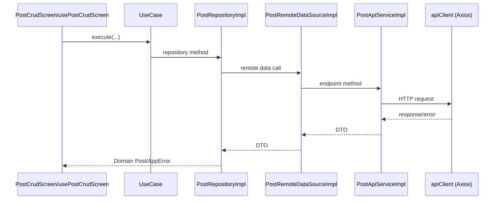

# Struc POC Codebase Documentation

## 1. Project Overview

This project is an **Expo + React Native** app that demonstrates CRUD operations against JSONPlaceholder posts using a layered architecture:

- `presentation` for UI/screens/hooks
- `domain` for business entities + use cases
- `data` for API/data-source/repository implementations
- `core` for cross-cutting concerns (networking, config, DI, errors, utilities)

Primary user flow:
- Load posts
- Create post
- Edit post
- Delete post

The main screen is `app/index.tsx`, which renders `PostCrudScreen`.

## 2. Tech Stack

- Framework: Expo SDK 54 + React Native 0.81 + React 19
- Routing: `expo-router`
- State/server cache: `@tanstack/react-query`
- HTTP: `axios`
- Dependency Injection: `tsyringe` + `reflect-metadata`
- Secure storage: `expo-secure-store`
- Network status: `expo-network`
- Language/tooling: TypeScript, ESLint (Expo config), Babel decorators metadata plugins

## 3. Directory Structure

```text
app/
  _layout.tsx                 # App bootstrap: DI init, QueryClientProvider, auth handlers
  index.tsx                   # Entry route -> PostCrudScreen

src/
  core/
    config/env.ts             # Environment/base URL resolution
    constants/MyConstants.ts  # Global constants (e.g., API timeout)
    di/
      tokens.ts               # DI token constants
      container.ts            # DI registrations for services/repositories/use cases
    errors/AppError.ts        # Unified app error model and error mapping
    network/apiClient.ts      # Axios client + request/response interceptors
    utils/                    # Utility modules (network, haptics, linking, etc.)

  domain/
    entities/Post.ts          # Domain entity
    repositories/PostRepository.ts # Repository contract
    usecases/                 # Get/Create/Update/Delete post use cases

  data/
    api/PostApiService.ts     # Raw API methods (REST endpoints)
    datasources/PostRemoteDataSource.ts # Data-source abstraction over API
    models/PostModel.ts       # DTO <-> domain mappings
    repositories/PostRepositoryImpl.ts # Repository implementation
    storage/                  # Secure local token storage

  presentation/
    components/
      PostCard.tsx            # Post list item UI
      CustomImage.tsx         # Generic image component (currently not used in main flow)
    navigation/RootNavigation.ts # Small router helper
    screens/postcrud/
      PostCrudScreen.tsx      # Screen UI
      usePostCrudScreen.ts    # Screen logic + query/mutation wiring
    theme/theme.ts            # Design tokens
```

## 4. Architecture and Dependencies

The app follows a practical Clean Architecture layering:

1. `presentation` depends on `domain` use cases (resolved through DI).
2. `domain` depends on repository interfaces only.
3. `data` implements repository interfaces and handles DTO mapping + remote calls.
4. `core` provides reusable infrastructure (HTTP client, env, errors, DI).

Dependency resolution path:

- `app/_layout.tsx` imports `@/core/di/container` once at startup.
- `src/core/di/container.ts` registers:
  - `PostApiServiceImpl`
  - `PostRemoteDataSourceImpl`
  - `PostRepositoryImpl`
  - use case instances (`GetPostsUseCase`, `CreatePostUseCase`, `UpdatePostUseCase`, `DeletePostUseCase`)
- `usePostCrudScreen` resolves use cases from `container`.

## 5. Runtime Workflow

### 5.1 App Startup

1. `app/_layout.tsx` runs first.
2. `reflect-metadata` and DI container are initialized.
3. React Query `QueryClientProvider` wraps the app.
4. Axios auth token provider is set to `LocalStore.getToken()`.
5. Unauthorized handler is set to clear token and route to `/`.

### 5.2 Data Fetch Flow (`GET /posts`)

1. `usePostCrudScreen` executes `useQuery` with key `["posts"]`.
2. Query calls `GetPostsUseCase.execute()`.
3. Use case calls `PostRepository.getPosts()`.
4. `PostRepositoryImpl` calls `PostRemoteDataSource.fetchPosts()`.
5. Data source calls `PostApiService.getPosts()`.
6. API service hits `/posts?_limit=20` via `apiClient`.
7. DTO list is mapped to domain `Post[]` via `PostModel.fromJsonList`.
8. UI renders list using `PostCard`.

### 5.3 Create/Update/Delete Flow

- **Create**: `createMutation` -> `CreatePostUseCase` -> repository -> data source -> `POST /posts`
- **Update**: `updateMutation` -> `UpdatePostUseCase` -> repository -> data source -> `PUT /posts/:id`
- **Delete**: `deleteMutation` -> `DeletePostUseCase` -> repository -> data source -> `DELETE /posts/:id`

React Query cache is updated optimistically on mutation success using `queryClient.setQueryData`, so UI updates immediately without waiting for a full refetch.

### 5.4 Error/Auth/Network Handling

- `apiClient` request interceptor:
  - checks internet connectivity via `expo-network`
  - injects bearer token if available
  - logs cURL in dev mode
- `apiClient` response interceptor:
  - on `401/403`, triggers unauthorized handler once (guarded by `isHandlingUnauthorized`)
- `AppError` system maps Axios/unknown errors to typed app codes:
  - `NETWORK_ERROR`, `UNAUTHORIZED`, `FORBIDDEN`, `NOT_FOUND`, etc.
- UI consumes readable messages via `getErrorMessage`.

## 6. Configuration

### 6.1 API Base URL

Resolved in `src/core/config/env.ts` in this order:

1. `process.env.EXPO_PUBLIC_API_BASE_URL`
2. `expoConfig.extra.apiBaseUrl` (from `app.config.ts`)
3. fallback: `https://jsonplaceholder.typicode.com`

Invalid URLs are automatically replaced by fallback.

### 6.2 App Config

`app.config.ts` defines:
- app metadata
- iOS bundle id / Android package
- splash config
- router plugin
- `extra.apiBaseUrl`

## 7. Developer Workflow

### 7.1 Common Commands

From `package.json`:

- `npm run start` -> Expo dev server
- `npm run android` -> run on Android
- `npm run ios` -> run on iOS
- `npm run web` -> run web target
- `npm run lint` -> lint via Expo config

### 7.2 Environment

Use `.env` with:

```env
EXPO_PUBLIC_API_BASE_URL=https://jsonplaceholder.typicode.com
```

## 8. Observations / Gaps

1. `README.md` is currently empty.
2. `package.json` contains `reset-project` script pointing to `scripts/reset-project.js`, but `scripts/` is not present.
3. `src/presentation/viewmodels/` exists but has no files.
4. Some utilities/components are currently not part of the main post CRUD flow (for example `CustomImage`, `HapticsUtils`, `ToastUtils`, `AlertUtils`, `LinkingUtils`).

## 9. High-Level Sequence



